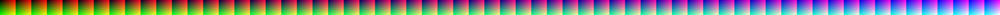

# MAME 3D LUTs

## About MAME LUTs

MAME supports 3D LUT ("Look Up Table") files for colour correction.  These are a 64x64x64 LUT, shaped as a 4096x64 pixel 8-bit PNG file.  
See "Technical details" below for more information on the file format, and how a LUT works in general. 

## Using these LUTs

These have been tested with MAME's BGFX renderer under Linux+Vulkan, Windows+Vulkan, Windows+D3D11 and Windows+D3D12. 

To use these LUTs, do the following:

1) Edit your `mame.ini` file, and ensure at least the following exist (the specific PNG file chosen for the `bgfx_lut` 
option here is just an example - choose any of the LUTs provided, and see the "Limitations" 
section below as to why these LUTs come in differently scaled percentages): 
```ini
video                     bgfx
bgfx_screen_chains        lut
bgfx_lut                  "lut_Raney_PVM_20M2U_090_percent.png"
```

Other optional things you can specify in `mame.ini` for Linux as an example, where we might want to force Vulkan rendering, 
and have the `artwork` folders where our LUT PNG files live in a custom folder, but out distro-provided package manager insists 
on putting internal MAME resources needed for other BGFX chains in system locations: 
```ini
artpath                   $HOME/games/mame/artwork;/usr/lib/mame/artwork
bgfx_backend              vulkan
```

Or for Windows as an example, where the `artwork` folder sits under `mame.exe`, and we want to force Direct3D 11 in this case:
```ini
artpath                   artwork
bgfx_backend              d3d11
```


2) Also check that there are no custom `.cfg` files in MAME's `cfg` folder that can conflict with these settings you're attempting here.

3) Place the PNG files in this repo into MAME's `artwork` folder.  This is specified by the `artpath` directive in your `mame.ini` file, and under Windows defaults to a folder
called `artwork`, which you should see as default where you have decompressed MAME. 

4) Run MAME with your chosen game.  You can optionally also do all of the above on the command line if you prefer, rather than editing your `mame.ini` file.

## Limitations

The LUTs are, by spec for the MAME project, 64x64x64 (6-bit per channel, 18-bit total), whereas MAME renders to a colour gamut of 256*256x256 (8-bit per channel, 24-bit total).  
As a result, some of the colour maths requires early rounding, and is slightly less accurate than a full matrix correction, or a larger LUT.  
However in practice, it isn't noticable. 

Also, because MAME renders in SDR, these conversions will clip on both the whitepoint and the primaries (the latter for non-sRGB matrices, 
as the sRGB_D93 lut shares the same primaries as the sRGB_D65 destination).  For a visual explanation of why this happens, 
see [this notebook](../jupyter/compare_gamut.ipynb). 

As such, the LUTs on offer here come in scaled versions, from 75% to 100% in increments of 5%.  At 74.54%, no clipping occurs when displaying D93 in D95, so scaling 
back a LUT to this maximum ensures no colour clipping.  The downside is loss of brightness, which can be compensated for with both controls inside of MAME, as well as 
manually increasing your screen's brightness.  

In other tools in this repo I offer gamma variations on files as well.  However MAME has its own gamma controls built in, so these are not necessary for these LUTs.  If you find the resulting 
gamma with some of these LUTs unpleasant, adjust the output via the `gamma` setting in your `mame.ini` file (or change it realtime via MAME's internal user interface). 

## Troubleshooting if you don't see changes

Check all settings above, and in particular ensure you don't have conflicting `.cfg` files in your `cfg` folder that ignore your new settings. 

The differences between these LUTs are quite subtle.  You may need to take screenshots with a third party screenshot tool (not the internal MAME snapshot tool, as it saves 
raw framebuffer information out before colour correction is applied, and won't show the differences).  To verify, grab screenshots of an all-white area with and without a LUT applied, 
and then check these with a colour-picker tool to see the R/G/B values. 

Some people trying the files out in this repo have been quite surprised to find out they are ever so slightly colour bind. Don't be alarmed - this probably won't affect you day-to-day.  But 
it is far more common than most people realise. 

## Differences to MAME's included files

MAME comes bundled with a file called `lut-default.png` which should exist in your `artwork` folder.  I'm not completely sure how this file was generated, however the rounding on 
the values doesn't match any standard `round`, `trunc`, `floor` or `ceil` style functions I could find.  

I have opted simply for simple integer rounding in my code 
when generating my `lut_mame_default.png` file.  It will 
differ slightly from MAME's bundled version, although only noticable via colour difference tools or inspection with a colour picker, 
and at most the error is a single bit and happens on fraction of the colours in the full gamut. 

## How these LUTs were made

All of the LUTs in this folder were generated by [this notebook](../jupyter/mame_3d_lut.ipynb)

## Technical details

A LUT (Look Up Table) is usually either a 1D (single dimension) or 3D (three dimensional) lookup table that can offer colour correction.  

1D LUTs correct only no the gamma curves, adjusting the whitepoint only (see the [MiSTer](../mister) folder in this repo for an example of a 1D LUT). 1D LUTs cannot compensate for 
differences in primary chromaticiies between colour spaces, for example. 

3D LUTs extend in three directions, typically mapped to the co-ordinates of the colourspace in question.  
MAME uses RGB, however some other systems use LUTs in colourspaces like XYZ, Lab, YUV, or others  instead. 

MAME expects a LUT that is 64x64x64, encoded as a 4096x64 pixel, 8-bit PNG. 

The unchanged "identity" LUT looks like the following:

The top most layer's four corner RGB triplets are:
* Top-left = 0,0,0 (black)
* Top-right = 255,0,0 (red)
* Bottom-left = 0,255,0 (green)
* Bottom-rght = 255,255,0 (yellow)

The bottom most layer's four corner RGB triplets are:
* Top-left = 0,0,255 (blue)
* Top-right = 255,0,255 (magenta)
* Bottom-left = 0,255,255 (cyan)
* Bottom-rght = 255,255,255 (white)

And the resulting file looks like this:



Imagine this as if all the coloured squares you see running left-to-right were stacked on top of each other, making a cube.  This is why 3D LUT files are often referred to as "cubes".  
The 8 vertices of this cube should contain the 3 primary colours, 3 secondary colours, and 2 tertiary values of any 3-co-ordinate colour system.  In this case, the primary colours Red, 
Green and Blue, the secondary colours Cyan (G+B), Yellow (R+G), and Magenta (R+B), and the tertiary values white and black (with the line between the tertiary values being a greyscale). 

Colour maths can be quite CPU intensive, especially for low end devices, and especially when the requirement is to run something like an emulator in realtime at 60FPS.  As such, instead of doing 
per-pixel colour correction with heavy matrix maths, a look-up table can be used instead.  For every pixel generated by the running application, at display time the software can look up the same 
location in the LUT, and substitute in that colour. 

Ideally the LUT should match the same number of colours used in the full colour gamut of the display system, but this also requires more memory and is more expensive on 
CPU cache (and because the LUT is in 3 dimensions, 
the memory requirements are cubed, so going from 64 colours per channel to 256 colours per channel is a 64x jump in memory).  A smaller LUT can be used to save considerable memory, 
and colours interpolated between points if needed.  It's also quite likely that things like old video games don't actually have full 24-bit colour palettes, so a full 256x256x256 LUT 
probably wouldn't be extremely different to a smaller 64x64x64 LUT in practice. 
